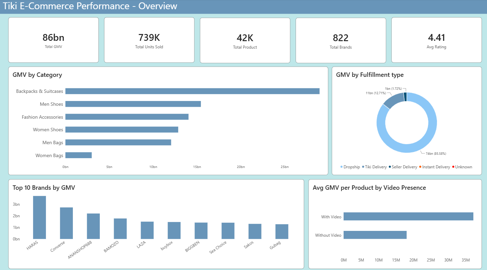
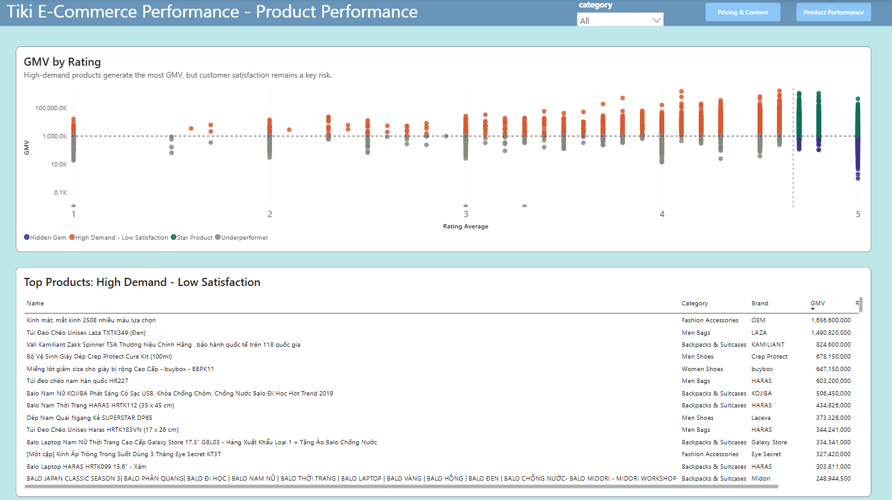
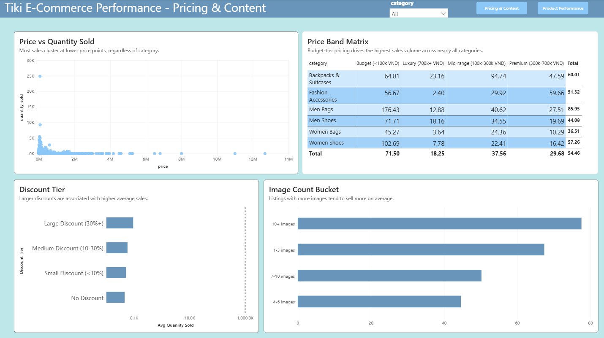
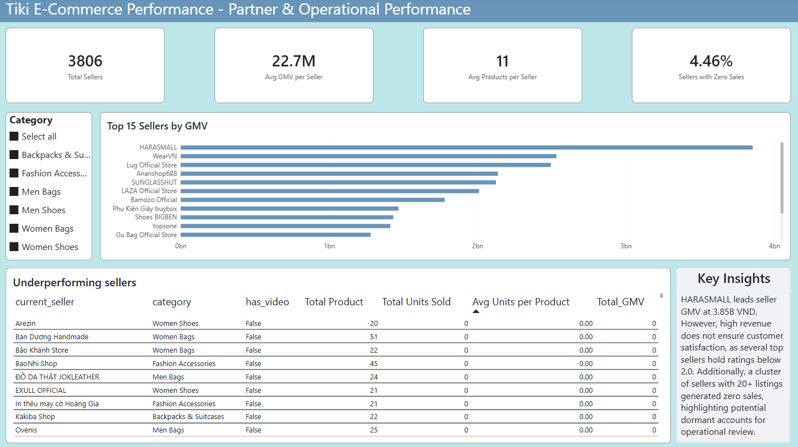

# Tiki Vietnam E-Commerce Market Analysis

An end-to-end data analytics project on 41,572 product listings from **Tiki**, one of Vietnam's largest e-commerce platforms, spanning six fashion and accessory categories. The project covers the full pipeline from raw data to business insight: **Python** for cleaning, **PostgreSQL** for business analysis, and **Power BI** for an interactive dashboard.

---

## Goal

Analyze product-level data across backpacks & suitcases, fashion accessories, men's and women's bags, and men's and women's shoes to uncover pricing patterns, brand and seller performance, and the drivers of customer engagement and sales — with the mindset of a data analyst supporting real e-commerce business decisions, not just running exploratory queries.

## Key Results

| Metric            | Value    |
| ----------------- | -------- |
| Total GMV         | 86bn VND |
| Products analyzed | 41,572   |
| Units sold        | 739K     |
| Sellers           | 3,806    |

**Top findings:**

- Backpacks & suitcases drives the highest GMV despite having fewer listings than fashion accessories — value comes from average order size, not catalog volume.
- A "High Demand – Low Satisfaction" product segment generates _more_ GMV than genuinely well-rated "Star Products" — a potential quality risk hiding inside the platform's best sellers.
- Video-enabled listings are associated with more than double the average GMV per product compared with listings without video.
- Several top-GMV sellers carry ratings below 2.0, and a cluster of sellers with 20+ listings recorded zero sales — a likely sign of dormant accounts.

Full findings with supporting numbers are in the [Word report](Reports/Tiki_Ecommerce_Analysis.docx).

---

## Project Structure

```
├── Dashboard/
│   └── Tiki_Ecommerce_Dashboard.pbix
├── Data/
│   ├── Raw/                # Original Tiki CSV exports (6 category files)
│   └── Processed/          # Cleaned, merged dataset
├── Images/                 # Dashboard screenshots
├── Notebook/
│   └── TIKI E-Commerce.ipynb   # Python cleaning + EDA
├── Reports/
│   ├── Tiki_Ecommerce_Analysis.docx
│   └── Tiki_Ecommerce_Analysis.pptx
├── SQL/
│   └── analysis.sql        # 8 business-question SQL queries
├── requirements.txt
└── README.md
```

---

## 1. Data Preparation (Python)

Six category-level CSV files (41,603 raw rows) were merged with pandas, then cleaned:

- Removed a redundant leftover index column from the original exports
- Resolved 27 duplicate product IDs across category files
- Replaced an unreliable `category` field (~40% generic "Root" placeholder values) with a category label derived from the source file
- Dropped rows with invalid zero pricing (1 row each in `price` and `original_price`)
- Fixed whitespace/tab corruption in `brand` (e.g. `"\tOEM"` merging with `"OEM"`) and one HTML-corrupted brand value
- Removed 3 rows with an implausible, identical placeholder value in the product-age field (`date_created`)
- Converted `pay_later` and `has_video` to proper boolean types

Result: a cleaned dataset of **41,572 rows × 18 columns**, exported to `Data/Processed/` and pushed to PostgreSQL via SQLAlchemy, with credentials managed through a `.env` file (never committed to the repo).

**EDA highlights:** price is heavily right-skewed; ~75% of products are unbranded ("OEM"); `review_count` (0.62) correlates far more strongly with `quantity_sold` than `rating_average` (0.15) or price (~0).

## 2. Business Analysis (SQL)

Eight PostgreSQL queries, each framed around a real business question rather than a syntax demo:

1. **GMV Analysis** — which categories and brands generate the most Gross Merchandise Value
2. **Product Performance Matrix** — a BCG-style quadrant (GMV × rating, split at the median) classifying products into Star Products, Hidden Gems, High Demand–Low Satisfaction, and Underperformers
3. **Discount Effectiveness** — whether discounting drives real sales lift or just erodes margin
4. **Seller Performance Analysis** — top revenue-driving sellers vs. large sellers that underperform
5. **Customer Engagement Analysis** — where reviews and ratings diverge from actual sales
6. **Product Content Quality** — impact of video, image count, and pay-later availability on sales
7. **Pricing Strategy** — which price bands perform best within each category
8. **Brand Positioning** — classifying brands as Premium, Mass-Market, or Standard by price and volume

**Methodology note:** medians and percentiles were used where GMV, review counts, and sales are right-skewed (Queries 2 and 5), while simple averages were used for straightforward group comparisons elsewhere — a deliberate choice explained further in the report. All findings are phrased in associative rather than causal language, since the dataset is observational, not experimental.

## 3. Interactive Dashboard (Power BI)

A three-page report built on the cleaned dataset:

- **Page 1 — Executive Overview:** KPI cards (GMV, units sold, products, brands, rating), GMV by category, GMV by fulfillment type, top 10 brands, and video vs. no-video sales comparison.
- **Page 2 — Product & Pricing Drill-down:** a GMV-vs-rating performance matrix (scatter, colored by quadrant) with a table of top "High Demand – Low Satisfaction" products, plus a **bookmark-driven toggle** switching between a Pricing view (discount tiers, price bands by category, price vs. quantity) and a Content Quality view (video presence, image count).
- **Page 3 — Partner & Operational Performance:** top 15 sellers by GMV, a table of underperforming sellers (20+ listings, zero units sold), and the share of sellers with no recorded sales.

| Overview                               | Product & Pricing Drill-down                                 |
| -------------------------------------- | ------------------------------------------------------------ |
|  |  |

| Pricing & Content (toggled view)                       | Partner & Operational Performance                              |
| ------------------------------------------------------ | -------------------------------------------------------------- |
|  |  |

---

## Tech Stack

- **Python** — pandas, numpy, matplotlib, seaborn, SQLAlchemy
- **SQL** — PostgreSQL
- **BI** — Power BI Desktop
- **Tools** — Jupyter/VSCode, pgAdmin, Git

## Limitations

This dataset captures a snapshot of popular, actively-ranked Tiki listings rather than the full catalog. GMV is estimated from list price × recorded quantity sold — it reflects platform-wide transaction volume, not Tiki's actual commission-based revenue. Rating is the only quality signal available, so "quality risk" findings are associative: this project does not claim to isolate the specific cause (product defects vs. delivery experience) behind low-rated, high-selling products.

---

## Author

**Nguyen Phuc Trong**
